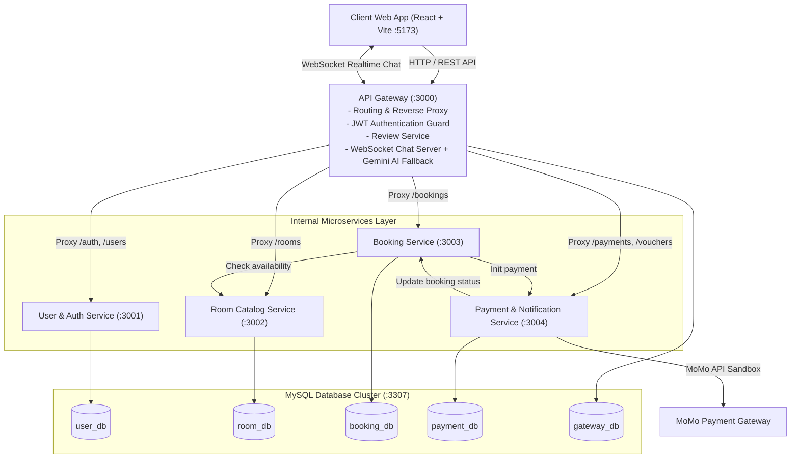

# 🏨 BOOKINGHOTEL - Hệ Thống Đặt Phòng Khách Sạn (Microservices)


<p align="center">
  <strong>Hệ thống đặt phòng khách sạn theo kiến trúc Microservices hiện đại, tin cậy và mở rộng linh hoạt.</strong>
</p>

<p align="center">
  
  
  
  
  
  
  
</p>

---

## 📖 Giới thiệu tổng quan

**BOOKINGHOTEL** là hệ thống đặt phòng khách sạn trực tuyến được thiết kế và triển khai hoàn toàn theo kiến trúc **Microservices**. Hệ thống kết hợp sức mạnh của **NestJS** ở phía Backend và **React + TypeScript (Vite, Tailwind CSS)** ở phía Frontend.

Dự án mô phỏng toàn diện quy trình vận hành thực tế của một nền tảng đặt phòng nghỉ dưỡng: từ tìm kiếm phòng, đặt chỗ, áp dụng mã ưu đãi (Voucher), tích hợp cổng thanh toán trực tuyến **MoMo Sandbox** (hỗ trợ thanh toán lại), cấp **Thẻ phòng điện tử (QR Code Check-in)**, cho đến kênh **Live Chat Chăm sóc khách hàng (CSKH) Realtime** kết hợp trợ lý AI thông minh (**Google Gemini AI**) tự động phản hồi khi nhân viên vắng mặt.

---

## 📋 Mục lục

1. [✨ Tính năng nổi bật](#-tính-năng-nổi-bật)
2. [🛠 Công nghệ sử dụng](#-công-nghệ-sử-dụng)
3. [🏗 Kiến trúc hệ thống & Danh sách Microservices](#-kiến-trúc-hệ-thống--danh-sách-microservices)
4. [🔄 Luồng nghiệp vụ chính](#-luồng-nghiệp-vụ-chính)
5. [👥 Phân công công việc](#-phân-công-công-việc)
6. [📁 Cấu trúc thư mục](#-cấu-trúc-thư-mục)
7. [🚀 Cài đặt & Khởi chạy dự án](#-cài-đặt--khởi-chạy-dự-án)
8. [⚙️ Cấu hình biến môi trường](#️-cấu-hình-biến-môi-trường)
9. [🛡️ Tài khoản dùng thử](#️-tài-khoản-dùng-thử)
10. [📡 Tài liệu API Endpoints](#-tài-liệu-api-endpoints)
11. [🌿 Git Workflow](#-git-workflow)
12. [📐 Quyết định thiết kế kiến trúc](#-quyết-định-thiết-kế-kiến-trúc)

---

## ✨ Tính năng nổi bật

### 1. Dành cho Khách hàng (Customer Web Portal)
- 🔍 **Tìm kiếm & Lọc phòng thông minh:** Xem danh sách phòng trực quan, lọc theo loại phòng (Standard, Deluxe, Suite,...), khoảng giá và trạng thái phòng trống.
- 📝 **Quy trình đặt phòng chuẩn hoá:** Đặt phòng nhanh chóng với biểu mẫu xác thực thông tin (họ tên, số điện thoại, địa chỉ nhận phòng, ghi chú).
- 🏷️ **Áp dụng Mã giảm giá (Voucher):** Nhập voucher khuyến mãi, hệ thống tự động kiểm tra tính hợp lệ và chiết khấu trực tiếp vào tổng tiền.
- 💳 **Cổng thanh toán đa dạng & MoMo Sandbox:**
  - Hỗ trợ thanh toán quét mã QR qua cổng MoMo Sandbox.
  - Tích hợp trang kết quả thanh toán Callback, cập nhật trạng thái đơn tức thì.
  - Hỗ trợ nút **Thanh toán lại** trực tiếp từ trang *Lịch sử đặt phòng* nếu giao dịch trước đó chưa hoàn tất hoặc gặp sự cố.
- 📱 **Thẻ phòng điện tử (QR Code Check-in):** Khách hàng nhận ngay Thẻ phòng điện tử chứa mã QR sau khi thanh toán thành công để xuất trình check-in nhanh tại quầy lễ tân.
- 💬 **Live Chat CSKH Realtime & Gemini AI Fallback:**
  - Nhắn tin trực tiếp với nhân viên hỗ trợ khách sạn qua WebSocket trong thời gian thực.
  - Tự động kích hoạt Chatbot **Google Gemini AI** thông minh làm lễ tân ảo tư vấn giá phòng, tiện ích và giải đáp thắc mắc khi nhân viên bận.
- ⭐ **Đánh giá & Phản hồi (Reviews):** Gửi đánh giá sao và bình luận trải nghiệm cho từng phòng nghỉ.

### 2. Dành cho Quản trị viên (Admin Dashboard)
- 📊 **Thống kê doanh thu & Tổng quan (Overview):** Biểu đồ doanh thu thực tế, tổng số đơn đặt phòng, tỷ lệ phòng đã lấp đầy thông qua thư viện biểu đồ Recharts.
- 👥 **Quản lý Người dùng (User Management CRUD):** Xem danh sách tài khoản, cập nhật thông tin, thay đổi phân quyền (Admin / Customer) và xóa tài khoản.
- 🏨 **Quản lý Danh mục phòng (Room Catalog CRUD):** Thêm phòng mới, cập nhật giá niêm yết, sửa thông tin mô tả, bật/tắt trạng thái phòng khả dụng.
- 📋 **Quản lý Đơn đặt phòng (Booking Management):** Theo dõi danh sách booking toàn hệ thống, phê duyệt đơn, hủy đơn và cập nhật trạng thái thanh toán.
- 🎧 **Trung tâm CSKH Trực tuyến (Admin Live Chat Center):** Tiếp nhận danh sách khách hàng đang nhắn tin, trả lời tin nhắn thời gian thực qua WebSocket.

---

## 🛠 Công nghệ sử dụng

| Phân hệ | Công nghệ | Chi tiết |
|:---|:---|:---|
| **Frontend** | React 18, TypeScript, Vite | UI component hiện đại, SPA hiệu năng cao |
| **Styling** | Tailwind CSS, Lucide React | Giao diện Responsive, icons trực quan |
| **Visualization** | Recharts | Vẽ biểu đồ thống kê doanh thu và báo cáo |
| **Backend** | NestJS 10, TypeScript | Kiến trúc module, Dependency Injection |
| **ORM** | TypeORM | Tương tác cơ sở dữ liệu quan hệ an toàn, tự động đồng bộ schema |
| **Database** | MySQL 8.0 | Mô hình Database-per-service (5 cơ sở dữ liệu riêng biệt) |
| **Xác thực** | JWT (JSON Web Token), Bcrypt | Stateless authentication, bảo mật mật khẩu |
| **Giao tiếp Realtime** | Socket.io, WebSockets | Kênh chat thời gian thực giữa Client và Admin |
| **Trí tuệ nhân tạo** | Google Gemini API (`gemini-1.5-flash`) | AI Fallback tự động trả lời khách hàng |
| **Cổng thanh toán** | MoMo Payment API (Sandbox) | Thanh toán trực tuyến quét mã QR |
| **Điều phối & Đóng gói**| Docker, Docker Compose | Chuẩn hoá môi trường chạy từ dev đến deployment |

---

## 🏗 Kiến trúc hệ thống & Danh sách Microservices

### Sơ đồ kiến trúc tổng thể



### Danh sách các Microservices

| Service | Port | Database | Nhiệm vụ chính |
|:---|:---:|:---:|:---|
| **API Gateway & Chat Service** | `3000` | `gateway_db` | Điểm tiếp nhận request duy nhất của hệ thống, định tuyến (proxy) tới các service nội bộ, kiểm tra JWT, quản lý đánh giá Review và cổng WebSocket Live Chat hỗ trợ Gemini AI. |
| **User & Auth Service** | `3001` | `user_db` | Đăng ký tài khoản, đăng nhập, cấp JWT Token, mã hóa mật khẩu, API quản lý và phân quyền người dùng (Admin / Customer). |
| **Room Catalog Service** | `3002` | `room_db` | Quản lý danh mục phòng, lọc theo loại phòng/giá tiền, kiểm tra trạng thái phòng trống (`availability`) phục vụ đơn đặt phòng. |
| **Booking Service** | `3003` | `booking_db` | Xử lý nghiệp vụ đặt phòng, quản lý trạng thái vòng đời của đơn đặt (`PENDING` ➔ `CONFIRMED` / `FAILED` / `CANCELLED`), kiểm tra phòng trống qua Room Service. |
| **Payment & Notification Service** | `3004` | `payment_db` | Tích hợp cổng thanh toán MoMo Sandbox, kiểm tra và khấu trừ Voucher giảm giá, cập nhật trạng thái đơn về Booking Service và gửi thông báo xác nhận. |
| **Frontend Web Client** | `5173` | N/A | Ứng dụng giao diện người dùng dành cho Khách hàng và Bảng điều khiển Quản trị viên (Admin Dashboard). |

> **Nguyên tắc thiết kế cốt lõi:** Áp dụng mẫu kiến trúc **Database-per-service**; mỗi microservice độc lập quản lý cơ sở dữ liệu của riêng mình nhằm đảm bảo tính toàn vẹn và loose coupling.

---

## 🔄 Luồng nghiệp vụ chính

### 1. Luồng Đặt phòng & Thanh toán MoMo
```
1. Khách hàng chọn phòng & thời gian lưu trú trên Frontend
2. Frontend gửi yêu cầu tạo booking: POST /api/bookings
3. API Gateway kiểm tra JWT Token và chuyển tiếp request đến Booking Service
4. Booking Service gọi Room Service: GET /rooms/:id/availability để kiểm tra phòng
5. Nếu phòng trống:
   - Booking Service tạo đơn với trạng thái: PENDING
   - Frontend gửi yêu cầu thanh toán: POST /api/payments (chọn phương thức MOMO)
   - Payment Service khởi tạo giao dịch qua MoMo API Sandbox và trả về link thanh toán (payUrl)
6. Khách hàng quét mã MoMo hoặc hoàn tất thanh toán
7. MoMo Callback / IPN gửi kết quả về Payment Service
8. Payment Service cập nhật trạng thái sang SUCCESS và gọi Booking Service cập nhật CONFIRMED
9. Frontend hiển thị Thẻ phòng điện tử (QR Code Check-in)
```

### 2. Luồng Đăng nhập & Xác thực (JWT Auth)
```
1. Khách hàng / Admin gửi: POST /api/auth/login (email + password)
2. API Gateway chuyển tiếp đến User & Auth Service
3. User Service xác thực mật khẩu bcrypt và sinh chuỗi JWT Access Token chứa userId, role
4. Client nhận và lưu JWT vào LocalStorage
5. Các request kế tiếp gắn kèm header: Authorization: Bearer <jwt_token>
```

### 3. Luồng Live Chat CSKH & Trợ lý Gemini AI
```
1. Khách hàng mở widget chat trên website, kết nối WebSocket tới API Gateway
2. Nếu Admin đang trực tuyến: Tin nhắn gửi trực tiếp tới Admin Dashboard Realtime
3. Nếu Admin vắng mặt hoặc không phản hồi kịp thời:
   - Hệ thống tự động kích hoạt ChatService với Google Gemini AI
   - AI đóng vai trò lễ tân ảo giải đáp thông tin phòng, giá cả và hướng dẫn đặt phòng
```

---

## 👥 Phân công công việc

| Họ và tên | Email | Service phụ trách & Đóng góp chính | Branch |
|:---|:---|:---|:---|
| **Trương Văn Phong** | k5phong0311@gmail.com | **API Gateway, Chat & Review Service:** Xây dựng cổng Gateway định tuyến, thiết lập WebSocket Server cho luồng tin nhắn Realtime giữa Admin và Khách hàng, tích hợp Google Gemini AI Fallback, xây dựng module Review phòng. | `feat/api-gateway` |
| **Trần Đức Hải** | 2311060742@hunre.edu.vn | **User & Auth Service:** Thiết kế xác thực JWT, bảo mật đăng nhập/đăng ký, xây dựng toàn bộ API CRUD người dùng và phân quyền (Admin / Customer) phục vụ quản trị. | `feat/user-auth` |
| **Nguyễn Thành Hưng** | 2311060608@hunre.edu.vn | **Room Catalog Service:** Quản lý danh mục phòng, bộ lọc tìm kiếm theo giá và loại phòng, kiểm tra trạng thái phòng trống. Xây dựng giao diện hiển thị **Thẻ phòng điện tử QR Code**. | `feat/room-catalog` |
| **Bùi Đại Dương** | 2311060706@hunre.edu.vn | **Booking Service:** Quản lý toàn bộ vòng đời đơn đặt phòng (`PENDING`, `CONFIRMED`, `CANCELLED`). Phụ trách luồng giao diện **BookingPage**: nhập thông tin khách hàng, tích hợp mã giảm giá Voucher. | `feat/booking-service` |
| **Đậu Ngọc Anh** | daungocanh90@gmail.com | **Payment & Notification Service:** Tích hợp quy trình thanh toán MoMo Sandbox, tính năng thanh toán lại trên MyBookings, quản lý Voucher. Thiết kế giao diện **Admin Dashboard** (biểu đồ doanh thu Recharts). | `feat/payment-notification` |

---

## 📁 Cấu trúc thư mục

```
booking_hotel-microservices/
├── api-gateway/                 # API Gateway, Review & Live Chat Service (Port: 3000)
│   ├── src/
│   │   ├── auth/                # JWT Auth guard & strategy
│   │   ├── chat/                # Socket.io Gateway & Gemini AI Service
│   │   ├── proxy/               # Reverse Proxy định tuyến tới các service
│   │   ├── review/              # Quản lý đánh giá phòng
│   │   ├── app.module.ts
│   │   └── main.ts
│   ├── .env.example
│   ├── Dockerfile
│   └── package.json
│
├── user-service/                # User & Auth Service (Port: 3001)
│   ├── src/
│   │   ├── auth/                # Đăng ký, đăng nhập, JWT
│   │   ├── users/               # Quản lý tài khoản & phân quyền
│   │   └── main.ts
│   ├── .env.example
│   ├── Dockerfile
│   └── package.json
│
├── room-service/                # Room Catalog Service (Port: 3002)
│   ├── src/
│   │   ├── rooms/               # CRUD phòng, tìm kiếm & kiểm tra phòng trống
│   │   └── main.ts
│   ├── .env.example
│   ├── Dockerfile
│   └── package.json
│
├── booking-service/             # Booking Service (Port: 3003)
│   ├── src/
│   │   ├── bookings/            # Nghiệp vụ đặt phòng, quản lý trạng thái
│   │   └── main.ts
│   ├── .env.example
│   ├── Dockerfile
│   └── package.json
│
├── payment-service/             # Payment & Notification Service (Port: 3004)
│   ├── src/
│   │   ├── payments/            # Xử lý thanh toán & MoMo Sandbox API
│   │   ├── vouchers/            # Quản lý mã giảm giá
│   │   ├── notifications/       # Gửi thông báo & email
│   │   └── main.ts
│   ├── .env.example
│   ├── Dockerfile
│   └── package.json
│
├── frontend/                    # Frontend React Web Client (Port: 5173)
│   ├── src/
│   │   ├── components/          # Navbar, ChatWidget, RoomCard, BookingSlideOver...
│   │   ├── pages/               # HomePage, BookingPage, MyBookingsPage, AdminDashboard...
│   │   ├── context/             # AuthContext, NotificationContext
│   │   ├── services/            # Axios API clients
│   │   └── types/               # TypeScript interfaces
│   ├── .env.example
│   ├── Dockerfile
│   └── package.json
│
├── docker-compose.yml           # Điều phối toàn bộ 7 containers
├── init.sql                     # Khởi tạo 5 database MySQL
└── README.md
```

---

## 🚀 Cài đặt & Khởi chạy dự án

### Yêu cầu môi trường
- [Git](https://git-scm.com/)
- [Docker Desktop](https://www.docker.com/products/docker-desktop/) (khuyến nghị chạy toàn bộ dự án)
- [Node.js](https://nodejs.org/) >= 18 (nếu muốn chạy cục bộ từng service)

---

### Cách 1: Khởi chạy bằng Docker Compose (Khuyến nghị)

Chỉ với 1 câu lệnh, toàn bộ hệ thống gồm MySQL (5 databases), 5 backend NestJS services và Frontend React sẽ được build và khởi động tự động.

```bash
# 1. Clone repository về máy
git clone https://github.com/k5phong0311-sketch/booking_hotel-microservices.git
cd booking_hotel-microservices

# 2. Khởi chạy toàn bộ hệ thống
docker-compose up --build -d

# 3. Kiểm tra danh sách các containers đang hoạt động
docker ps
```

Sau khi khởi chạy thành công:
- 🌐 **Frontend Web:** [http://localhost:5173](http://localhost:5173)
- 🔀 **API Gateway:** [http://localhost:3000/api](http://localhost:3000/api)
- 🗄️ **MySQL Database:** `localhost:3307` (User: `hotel_user`, Password: `hotel_password`)

---

### Cách 2: Khởi chạy thủ công cho môi trường Phát triển (Local Development)

#### Bước 1: Khởi động cơ sở dữ liệu MySQL bằng Docker
```bash
docker-compose up -d mysql
```
> Lệnh này sẽ tự động tạo 5 database: `gateway_db`, `user_db`, `room_db`, `booking_db`, `payment_db` dựa vào file [init.sql](file:///d:/Phong/booking_hotel-microservices/init.sql).

#### Bước 2: Khởi chạy từng Microservice
Tại mỗi thư mục service (`api-gateway`, `user-service`, `room-service`, `booking-service`, `payment-service`):
```bash
# Copy file môi trường mẫu
cp .env.example .env

# Cài đặt thư viện
npm install

# Khởi chạy ở chế độ dev (hot-reload)
npm run start:dev
```

#### Bước 3: Khởi chạy Frontend React
```bash
cd frontend
cp .env.example .env
npm install
npm run dev
```

---

## ⚙️ Cấu hình biến môi trường

Mỗi microservice có file `.env.example` riêng biệt. Dưới đây là bảng tổng hợp các biến môi trường cấu hình:

### 1. API Gateway (`api-gateway/.env`)
```env
PORT=3000
DB_HOST=localhost
DB_PORT=3306
DB_USERNAME=hotel_user
DB_PASSWORD=hotel_password
DB_NAME=gateway_db

JWT_SECRET=super_secret_key_123

USER_SERVICE_URL=http://localhost:3001
ROOM_SERVICE_URL=http://localhost:3002
BOOKING_SERVICE_URL=http://localhost:3003
PAYMENT_SERVICE_URL=http://localhost:3004

# Tuỳ chọn: Kích hoạt Gemini AI Chatbot
GEMINI_API_KEY=your_gemini_api_key_here
```

### 2. User Service (`user-service/.env`)
```env
PORT=3001
DB_HOST=localhost
DB_PORT=3306
DB_USERNAME=hotel_user
DB_PASSWORD=hotel_password
DB_NAME=user_db
JWT_SECRET=super_secret_key_123
JWT_EXPIRES_IN=7d
```

### 3. Room Service (`room-service/.env`)
```env
PORT=3002
DB_HOST=localhost
DB_PORT=3306
DB_USERNAME=hotel_user
DB_PASSWORD=hotel_password
DB_NAME=room_db
```

### 4. Booking Service (`booking-service/.env`)
```env
PORT=3003
DB_HOST=localhost
DB_PORT=3306
DB_USERNAME=hotel_user
DB_PASSWORD=hotel_password
DB_NAME=booking_db
ROOM_SERVICE_URL=http://localhost:3002
PAYMENT_SERVICE_URL=http://localhost:3004
```

### 5. Payment Service (`payment-service/.env`)
```env
PORT=3004
DB_HOST=localhost
DB_PORT=3306
DB_USERNAME=hotel_user
DB_PASSWORD=hotel_password
DB_NAME=payment_db
BOOKING_SERVICE_URL=http://localhost:3003
USER_SERVICE_URL=http://localhost:3001
```

### 6. Frontend Client (`frontend/.env`)
```env
VITE_API_URL=http://localhost:3000/api
```

---

## 🛡️ Tài khoản dùng thử

Hệ thống cung cấp sẵn các tài khoản mẫu để kiểm thử tính năng:

| Vai trò | Email đăng nhập | Mật khẩu | Quyền hạn và Chức năng kiểm thử |
|:---|:---|:---|:---|
| **Quản trị viên (Admin)** | `admin@bookinghotel.com` | `admin123` | Truy cập Admin Dashboard, xem biểu đồ doanh thu, quản lý phòng, duyệt/hủy booking, quản lý user, trực tiếp chat CSKH với khách. |
| **Khách hàng (Customer)** | `customer@bookinghotel.com` | `123456` | Tìm phòng, đặt phòng, nhập mã giảm giá, thanh toán MoMo Sandbox, xem mã QR thẻ phòng, chat với tư vấn viên/AI. |

---

## 📡 Tài liệu API Endpoints

Tất cả các yêu cầu từ Frontend đều được gửi qua **API Gateway** tại địa chỉ: `http://localhost:3000/api`

> **Xác thực JWT:** Các endpoint yêu cầu quyền đăng nhập cần kèm theo header:
> ```http
> Authorization: Bearer <access_token>
> ```

### 1. Xác thực & Người dùng (`/api/auth`, `/api/users`)
| Phương thức | Endpoint | Mô tả | Yêu cầu xác thực |
|:---|:---|:---|:---:|
| `POST` | `/api/auth/register` | Đăng ký tài khoản khách hàng mới | ❌ |
| `POST` | `/api/auth/login` | Đăng nhập tài khoản, trả về JWT Token | ❌ |
| `GET` | `/api/users` | Lấy danh sách tất cả người dùng (Admin) | ✅ |
| `GET` | `/api/users/:id` | Xem thông tin chi tiết một người dùng | ✅ |
| `PATCH` | `/api/users/:id` | Cập nhật thông tin/phân quyền người dùng | ✅ |
| `DELETE` | `/api/users/:id` | Xóa người dùng khỏi hệ thống | ✅ |

### 2. Quản lý Phòng (`/api/rooms`)
| Phương thức | Endpoint | Mô tả | Yêu cầu xác thực |
|:---|:---|:---|:---:|
| `GET` | `/api/rooms` | Lấy danh sách phòng (hỗ trợ query `?type=...`) | ❌ |
| `GET` | `/api/rooms/price` | Lọc phòng theo tầm giá (`?min=...&max=...`) | ❌ |
| `GET` | `/api/rooms/:id` | Xem chi tiết thông tin một phòng | ❌ |
| `GET` | `/api/rooms/:id/availability`| Kiểm tra tình trạng phòng còn trống hay không | ❌ |
| `POST` | `/api/rooms` | Thêm phòng mới (Admin) | ✅ |
| `PATCH` | `/api/rooms/:id` | Cập nhật thông tin phòng (Admin) | ✅ |
| `PATCH` | `/api/rooms/:id/toggle-availability` | Chuyển đổi trạng thái khả dụng của phòng | ✅ |
| `DELETE` | `/api/rooms/:id` | Xóa phòng (Admin) | ✅ |

### 3. Quản lý Đặt phòng (`/api/bookings`)
| Phương thức | Endpoint | Mô tả | Yêu cầu xác thực |
|:---|:---|:---|:---:|
| `GET` | `/api/bookings` | Xem toàn bộ danh sách đơn đặt phòng (Admin) | ✅ |
| `POST` | `/api/bookings` | Tạo đơn đặt phòng mới | ✅ |
| `GET` | `/api/bookings/user/:userId` | Xem lịch sử đặt phòng của một khách hàng | ✅ |
| `GET` | `/api/bookings/:id` | Xem chi tiết một đơn đặt phòng | ✅ |
| `PATCH` | `/api/bookings/:id/confirm` | Phê duyệt đơn đặt phòng (Admin) | ✅ |
| `PATCH` | `/api/bookings/:id/cancel` | Hủy đơn đặt phòng | ✅ |
| `PATCH` | `/api/bookings/:id/status` | Cập nhật trạng thái đơn đặt (gọi nội bộ) | ✅ |

### 4. Thanh toán & Voucher (`/api/payments`, `/api/vouchers`)
| Phương thức | Endpoint | Mô tả | Yêu cầu xác thực |
|:---|:---|:---|:---:|
| `POST` | `/api/payments` | Khởi tạo giao dịch thanh toán (MoMo Sandbox / Thẻ) | ✅ |
| `POST` | `/api/payments/momo/ipn` | Webhook tiếp nhận callback từ MoMo | ❌ |
| `GET` | `/api/payments` | Lấy danh sách các giao dịch thanh toán (Admin) | ✅ |
| `GET` | `/api/payments/stats/summary`| Thống kê tổng hợp doanh thu và số lượng giao dịch | ✅ |
| `GET` | `/api/payments/booking/:bookingId` | Tìm giao dịch theo mã đơn đặt phòng | ✅ |
| `GET` | `/api/payments/user/:userId` | Lấy danh sách giao dịch theo khách hàng | ✅ |
| `POST` | `/api/payments/:id/refund` | Yêu cầu hoàn tiền giao dịch | ✅ |
| `POST` | `/api/vouchers/apply` | Kiểm tra và áp dụng mã giảm giá | ✅ |

### 5. Đánh giá & Nhận xét (`/api/reviews`)
| Phương thức | Endpoint | Mô tả | Yêu cầu xác thực |
|:---|:---|:---|:---:|
| `POST` | `/api/reviews` | Gửi bài đánh giá cho phòng | ✅ |
| `GET` | `/api/reviews/room/:roomId` | Xem danh sách đánh giá của một phòng | ❌ |
| `GET` | `/api/reviews/:id` | Xem chi tiết một bài đánh giá | ❌ |
| `DELETE` | `/api/reviews/:id` | Xóa bài đánh giá vi phạm (Admin) | ✅ |

---

## 🌿 Git Workflow

Dự án áp dụng mô hình **Feature Branch Workflow** giúp các thành viên phát triển song song, giảm thiểu xung đột mã nguồn:

### 1. Quy ước đặt tên nhánh (Branch Naming)
```
feat/<ten-service-hoac-tinh-nang>
```
Ví dụ:
- `feat/api-gateway`
- `feat/user-auth`
- `feat/room-catalog`
- `feat/booking-service`
- `feat/payment-notification`

### 2. Quy ước Commit Messages (Conventional Commits)
| Tiền tố | Ý nghĩa | Ví dụ |
|:---|:---|:---|
| `feat:` | Phát triển tính năng mới | `feat(payment): integrate MoMo sandbox payment flow` |
| `fix:` | Sửa lỗi hệ thống | `fix(auth): resolve JWT expiration token verification` |
| `docs:` | Cập nhật tài liệu kỹ thuật | `docs: update system architecture and api endpoints` |
| `refactor:` | Tái cấu trúc mã nguồn | `refactor(booking): optimize room availability check query` |
| `chore:` | Thiết lập cấu hình / Docker | `chore: update docker-compose services healthcheck` |

---

## 📐 Quyết định thiết kế kiến trúc

| # | Khía cạnh | Quyết định kỹ thuật | Rationale (Lý do lựa chọn) |
|:---:|:---|:---|:---|
| **1** | **Giao tiếp giữa các services** | REST API đồng bộ & HTTP Service | Trực quan, dễ theo dõi, phù hợp quy mô dự án nghiên cứu microservices thực chiến. |
| **2** | **Kênh Chat CSKH** | WebSocket (Socket.io) | Truyền tải tin nhắn hai chiều tốc độ cao, độ trễ thấp và tích hợp mượt mà với React. |
| **3** | **Cơ sở dữ liệu** | Database-per-service (MySQL 8.0) | Đảm bảo tính độc lập tuyệt đối giữa các services; nếu 1 service gặp sự cố, các service khác vẫn hoạt động ổn định. |
| **4** | **Cơ chế xác thực** | Stateless JWT (Json Web Token) | Không cần chia sẻ session giữa các service, dễ dàng scale theo chiều ngang. |
| **5** | **Xử lý giao dịch phân tán** | Compensating Action | Nếu giao dịch thanh toán thất bại, trạng thái booking tự động chuyển sang `FAILED` hoặc hoàn tiền để đảm bảo tính nhất quán dữ liệu. |

---

<p align="center">
  Đồ án kiến trúc Microservices - Được xây dựng với ❤️ bởi <strong>Group 10</strong>
</p>
